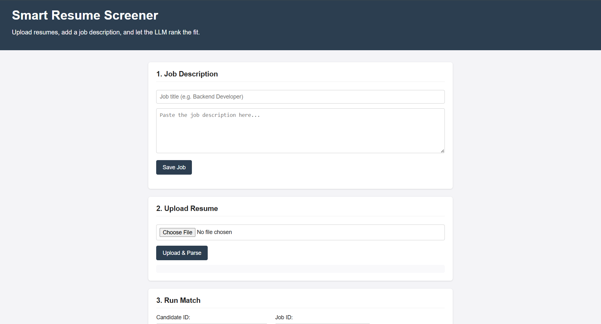
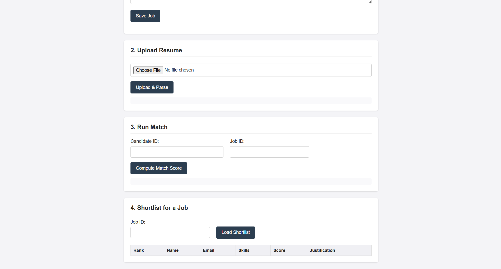

# 🚀 Smart Resume Screener — AI-Powered ATS & Resume Matching System

An AI-powered Resume Screening System that parses resumes, extracts candidate information, and intelligently matches candidates against job descriptions using **Claude AI**, **FastAPI**, and **SQLite**. The application provides recruiters with automated resume ranking and justification, making the hiring process faster and smarter.

**🌐 Live Demo:** https://smart-resume-screener-azure.vercel.app

**🔗 Backend API:** https://smart-resume-screener-rvc7.onrender.com

**💻 GitHub Repository:** https://github.com/NKS2008/smart-resume-screener

---

## ✨ Features

* 📄 Upload resumes in **PDF** or **TXT** format.
* 🧠 Extract candidate details (Name, Email, Phone, Skills, Education, Experience).
* 📝 Create job descriptions through a simple interface.
* 🤖 AI-powered resume matching using **Claude AI**.
* 📊 Generate a **match score (0–10)** with detailed justification.
* 🏆 Automatically shortlist and rank candidates by score.
* 🌐 Fully deployed frontend and backend for live access.

---

## 🛠️ Tech Stack

| Technology                  | Purpose                      |
| --------------------------- | ---------------------------- |
| **Python**                  | Backend programming language |
| **FastAPI**                 | REST API backend             |
| **SQLite**                  | Candidate & job database     |
| **Claude AI API**           | Intelligent resume matching  |
| **HTML5, CSS3, JavaScript** | Frontend UI                  |
| **Vercel**                  | Frontend deployment          |
| **Render**                  | Backend deployment           |
| **Git & GitHub**            | Version control and hosting  |

---

## 🏗️ Project Architecture

```text
Frontend (HTML/CSS/JS)
        │
        ▼
FastAPI Backend (Render)
        │
        ├── Resume Parser
        ├── Claude AI Matcher
        └── SQLite Database
```

---

## 📂 Project Structure

```text
smart-resume-screener/
│
├── backend/
│   ├── main.py              # FastAPI application
│   ├── database.py          # SQLite database operations
│   ├── llm_matcher.py       # Claude AI resume matching
│   ├── models.py            # Request models
│   ├── resume_parser.py     # Resume parsing logic
│   └── __init__.py
│
├── frontend/
│   ├── index.html
│   ├── style.css
│   └── script.js
│
├── sample_data/
│   ├── sample_resume.txt
│   └── sample_job_description.txt
│
├── requirements.txt
├── .env.example
├── .gitignore
└── README.md
```

---

## 🚀 Live Deployment

### Frontend (Vercel)

https://smart-resume-screener-azure.vercel.app

### Backend (Render)

https://smart-resume-screener-rvc7.onrender.com

---

## ⚙️ Local Installation

### 1. Clone the repository

```bash
git clone https://github.com/NKS2008/smart-resume-screener.git
cd smart-resume-screener
```

### 2. Install dependencies

```bash
pip install -r requirements.txt
```

### 3. Configure Environment Variables

Create a `.env` file in the project root.

```env
ANTHROPIC_API_KEY=YOUR_CLAUDE_API_KEY
```

> Never commit your API key to GitHub.

### 4. Run the backend

```bash
cd backend
uvicorn main:app --reload
```

Backend runs at:

```text
http://localhost:8000
```

### 5. Run the frontend

Open `frontend/index.html` in your browser.

---

## 📡 API Endpoints

| Method | Endpoint              | Description                  |
| ------ | --------------------- | ---------------------------- |
| `GET`  | `/`                   | API health check             |
| `POST` | `/resumes/upload`     | Upload and parse resume      |
| `POST` | `/jobs`               | Create job description       |
| `POST` | `/match`              | Generate AI match score      |
| `GET`  | `/shortlist/{job_id}` | Ranked candidate shortlist   |
| `GET`  | `/candidates`         | List all uploaded candidates |

---

## 📖 How It Works

1. Recruiter creates a job description.
2. Candidate uploads a resume.
3. Resume parser extracts structured information.
4. Claude AI compares resume with job description.
5. System returns:

   * Match Score (0–10)
   * AI Justification
   * Ranked shortlist of candidates

---

## 📸 Application Workflow

### Step 1 — Create Job Description

Enter the job title and required skills.

### Step 2 — Upload Resume

Upload a PDF or TXT resume.

### Step 3 — AI Matching

Generate an intelligent compatibility score.

### Step 4 — Candidate Shortlist

Candidates are ranked by AI score.

> *Add screenshots here after capturing your website.*

---
## 📸 Application Screenshots

### 🏠 Home Page

The landing page allows recruiters to create a job description, upload resumes, and perform AI-powered resume screening.



---

### ⚙️ Resume Upload, AI Matching & Shortlisting

Upload a candidate resume, generate an AI compatibility score using Claude AI, and view shortlisted candidates ranked by score.



## 🎯 Future Enhancements

* Resume OCR for scanned PDFs.
* Semantic search using embeddings.
* Recruiter dashboard with analytics.
* Email notifications to shortlisted candidates.
* Multi-job candidate comparison.
* PostgreSQL/MySQL database support.

---

## 📚 Skills Demonstrated

* FastAPI REST API Development
* AI Integration using Claude API
* Resume Parsing with Python
* SQLite Database Management
* Frontend Development (HTML, CSS, JavaScript)
* Full Stack Deployment (Vercel + Render)
* Git & GitHub Version Control

---

## 👩‍💻 Author

**Kavya S N**

B.Tech Computer Science Engineering | VIT-AP University

* GitHub: https://github.com/NKS2008

---
